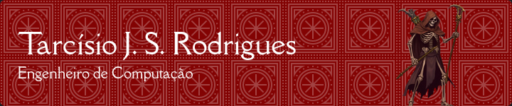

Entusiasta da feitiçaria do JavaScript e praticante da magia dos servidores web, sou um estudante ávido de programação que busca dominar a arte de comandar máquinas. Atualmente, estou cursando Engenharia de Computação na Universidade Federal de Mato Grosso, onde busco aprimorar meus conhecimentos e habilidades técnicas. Este repositório no GitHub é um reflexo do meu aprendizado e das minhas experiências, onde compartilho projetos, códigos e aprendizados. Sinta-se à vontade para explorar e contribuir. Juntos, podemos avançar no universo da tecnologia e da programação.

## Agradecimentos
Gostaria de expressar minha sincera gratidão aos meus pais, cujo apoio e orientação foram fundamentais para pavimentar o meu caminho inicial em direção ao sucesso. Agradeço também a todos os professores que, com dedicação e expertise, foram além do senso comum ao me ensinarem. Além disso, agradeço a todas as outras pessoas que, direta ou indiretamente, estiveram ao meu lado ao longo da minha jornada, pois cada uma delas desempenhou um papel importante no meu crescimento e desenvolvimento pessoal. Obrigado a todos por fazerem parte da minha trajetória.

### Para citar algumas
- [Maurício Severo](https://github.com/mauricioss777), um grande amigo.
- [Álex Allan](https://github.com/BloopersNF), parceiro de estudos na graduação de Engenharia da Computação na Universidade Federal de Mato Grosso.
