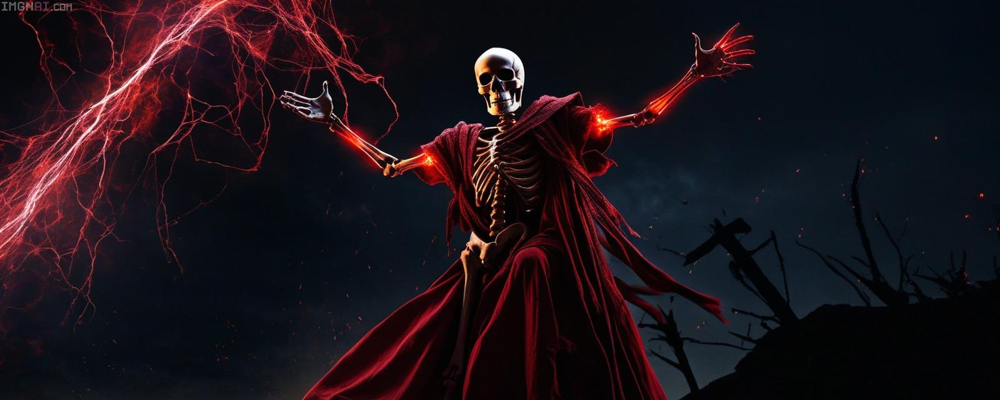

🧙‍♂️ O Grimório do Feiticeiro da Computação

Saudações, aventureiro do código! Eu sou um Feiticeiro nas artes digitais, moldando o fluxo arcano das máquinas com o poder da ciência dos bits e bytes.

Com minha varinha (também conhecida como teclado) e grimórios de feitiços (códigos e scripts), invoco encantamentos em diversas linguagens de programação, sem me prender a nenhuma em particular. Minha magia vem da compreensão profunda do que está por trás das palavras e símbolos—não sou um seguidor fiel de uma só escola de magia (ou linguagem), mas um Feiticeiro que busca o conhecimento onde quer que ele se manifeste.

Durante minha jornada pela Engenharia da Computação, lanço meus feitiços sobre arquiteturas, redes místicas (ou, como alguns chamam, redes de computadores) e encantamentos de software que transformam ideias em realidade.

Neste grimório, você encontrará artefatos e pergaminhos que registram minhas aventuras e projetos, todos guiados pela lógica, pela criatividade e pela busca constante por novos feitiços.

Seja bem-vindo(a) a este repositório, onde a magia e a ciência se fundem de forma surpreendente!

